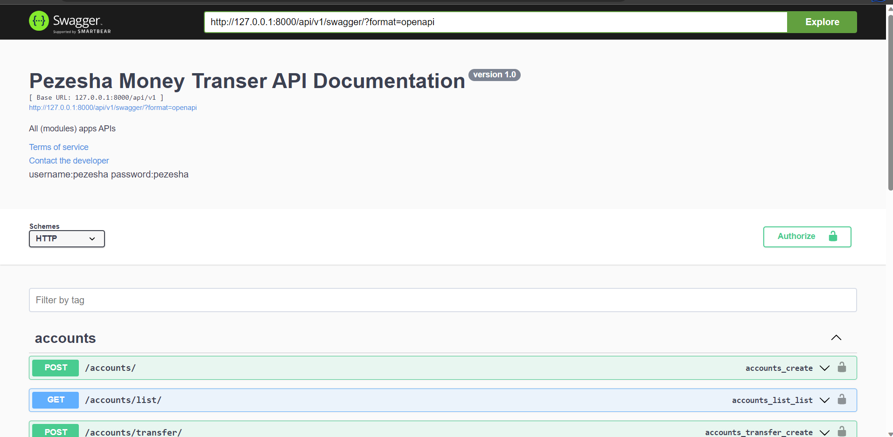
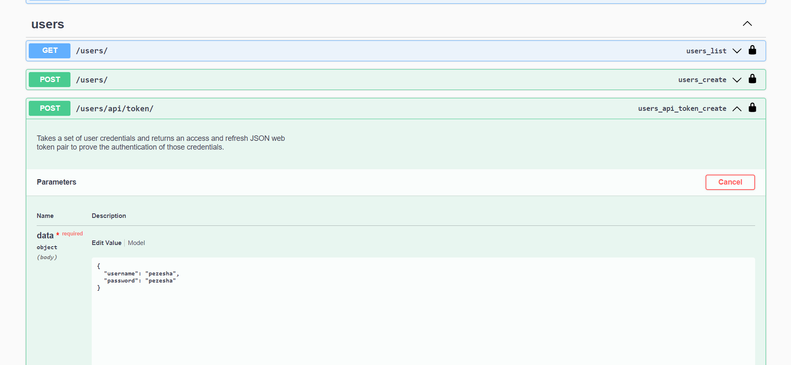
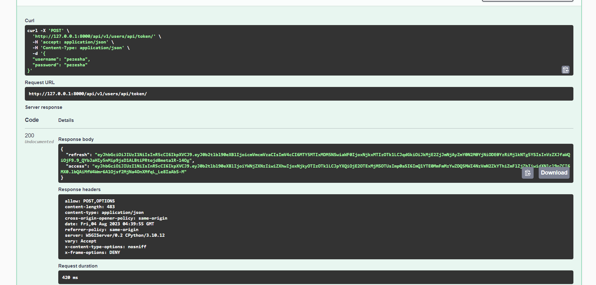
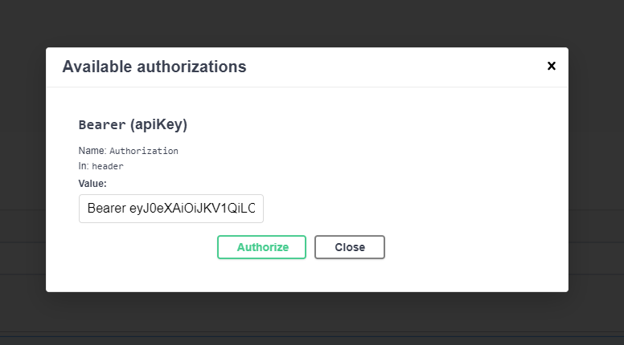
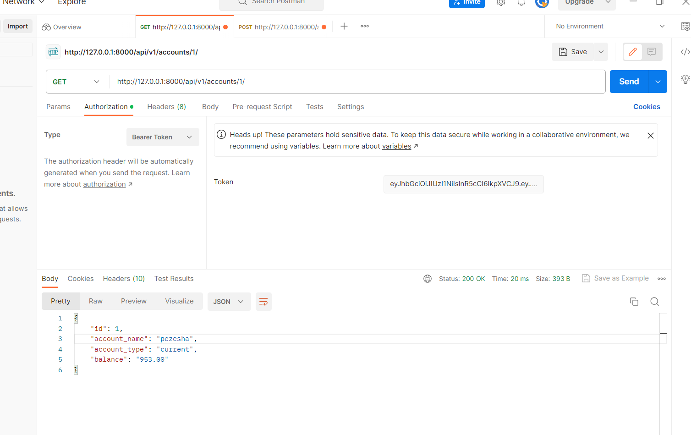
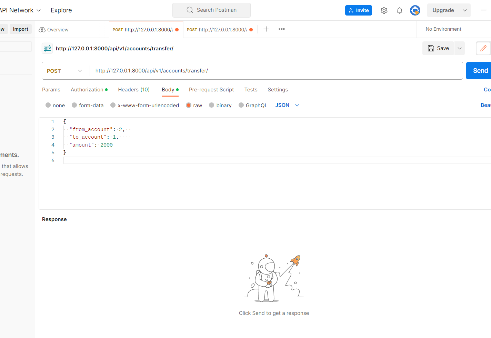

# Pezesha



You can use Swagger or Postman to test the endpoints.

## Run with Docker Compose

This works if you have docker instlled

Run services:
```
docker-compose up -d --remove-orphans
```

Bring services down:
```
docker-compose down
```

## On Windows

Install python 3.11

Install requirements
```
pip install -r reuirements.txt
```

Run the project
```
python manage.py runserver
```

## Delployment

The docker image is deployed to the Image registry. You simply pull and run the image.

## Auth Endpoint



Go to this endpoint use username:pezesha password:pezesha 



Copy access token



Go to authorize and paste the token, the close.

## Create Account Endpoint


Use this to create account.

```
{
  "account_name": "test",
  "account_type": "current_account",
  "balance": "1000"
}
````

## List accounts Endpoint



```
http://127.0.0.1:8000/api/v1/accounts/1/
```

This will list the account with id 1

## Money Transfer Endpoint



```
{
  "from_account": 2,  
  "to_account": 1,    
  "amount": 2000
}
```
