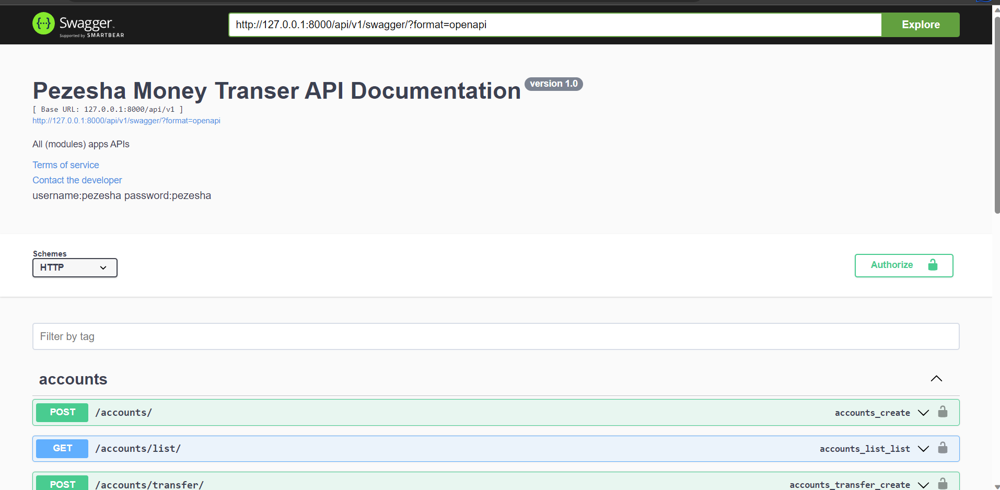
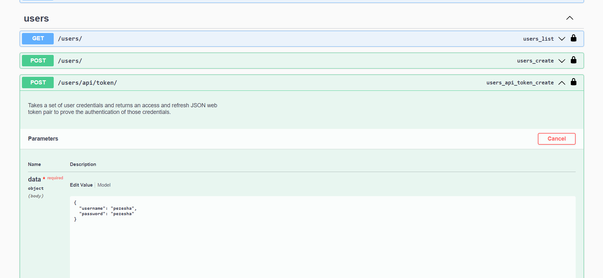
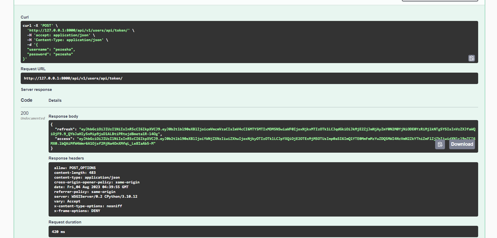
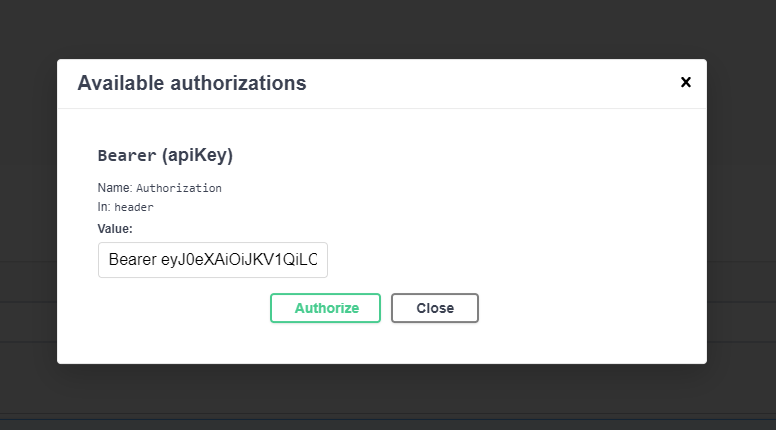
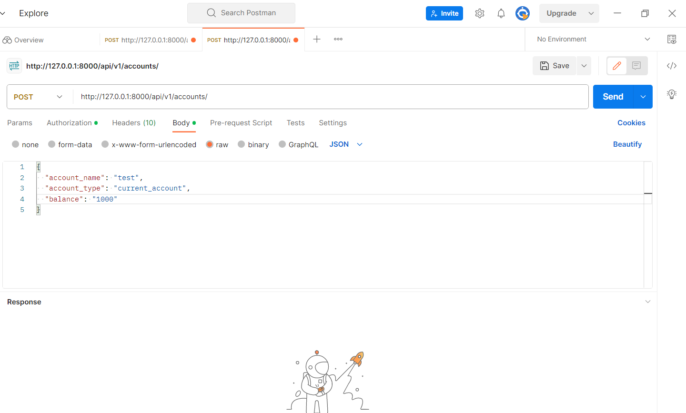
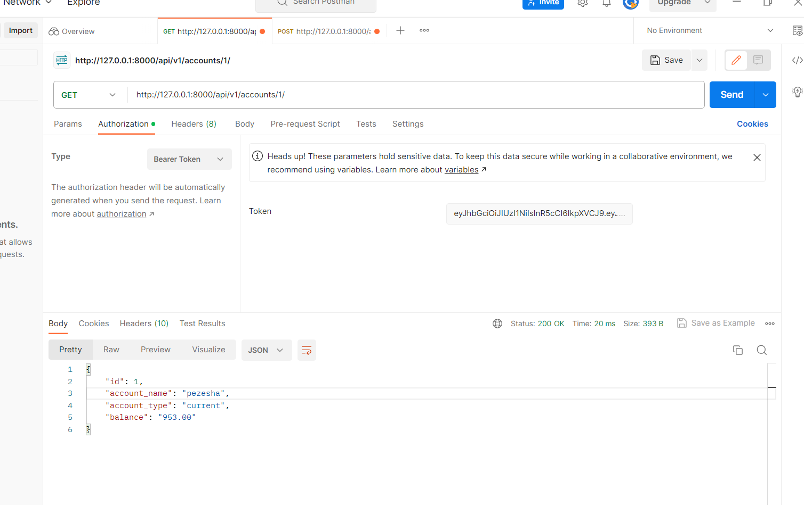
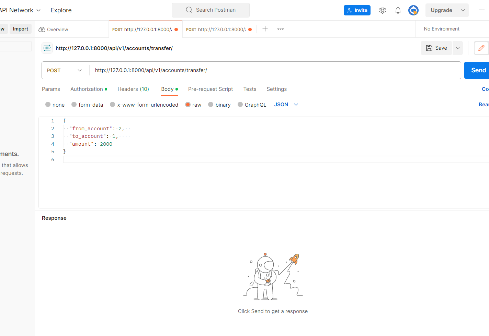

# Pezesha



## Run with Docker

```
 docker pull auabake/pezesha
```

```
docker run -p 8000:8000 auabake/pezesha
```

the application will be running on
`http://127.0.0.1:8000/api/v1/swagger/` you can access with Swagger or Postman

## Run with Docker Compose

This works if you have docker compose installed

Clone the repo cd into the repo.

Run services:

```
docker compose up -d --remove-orphans
```

Bring services down:

```
docker compose down
```

## On Windows / Linux

Install python 3.11

Install requirements
```
pip install -r reuirements.txt
```

Run the project
```
python manage.py runserver
```

## Delployment CI/CD Devops

The docker image is deployed to the Image registry. You simply pull and run the image. In your pipeline.

## Auth Endpoint



Go to this endpoint use username:pezesha password:pezesha



Copy access token



Go to authorize and paste the token, the close.

## Create Account Endpoint



Use this to create account

```
{
  "account_name": "test",
  "account_type": "current_account",
  "balance": "1000"
}
````

## List accounts Endpoint



```
http://127.0.0.1:8000/api/v1/accounts/1/
```

This will list the account with id 1

## Money Transfer Endpoint



```
{
  "from_account": 2,  
  "to_account": 1,    
  "amount": 2000
}
```
